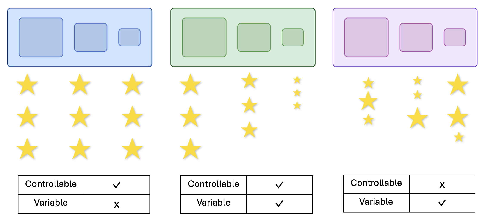

# Children use both controllability and variability for generalization.
[Eunice Yiu](https://ey242.github.io/), [Anisa Noor Majhi](https://www.linkedin.com/in/anisamajhi), [Shiry Ginosar](https://shiry.ttic.edu/), [Kelsey Allen](https://k-r-allen.github.io/), [Alison Gopnik](http://alisongopnik.com/)

in press at CogSci2025

## Abstract

 Humans actively learn to build causal models of the world. These models help them navigate their environment, act effectively, and pursue goals. To achieve this, they explore in order to maximize control and variability by prioritizing outcomes that are both causally controllable and diverse (Gopnik, 2024; Klyubin et al., 2005). While prior research has examined these components separately, demonstrating that even young children possess strong causal learning capabilities; and seek novelty, surprising deviations and confounded outcomes, it remains unclear whether they prioritize both controllability and variability together over either alone. We presented five- to ten-year-old children and adults with three virtual machines: one with controllability but no variability, one with variability but no controllability, and one with both (exhibiting systematic parallel variation between inputs and outputs). We found that children and adults overwhelmingly preferred the machine with both controllability and variability to perform various new tasks, generalizing and applying its abstract functional structure to different inputs and modalities. In contrast, during free exploration, children did not prioritize outcomes that are both controllable and variable.

    

In this study, participants are presented with three machines, each differing in the controllability and variability of their outputs.
(a) The purely controllable machine produces a single, deterministic output across all slots.
(b) The controllable and variable machine yields three distinct outputs, each reliably tied to slot size.
(c) The purely variable machine generates three different outputs in a fully stochastic manner, with no predictable pattern.
Participants are then asked to generalize and design a novel causal intervention using any slot from any machine of their choice.

## Running the Experiment

To run the experiment, launch `index.html` on an Internet browser.
